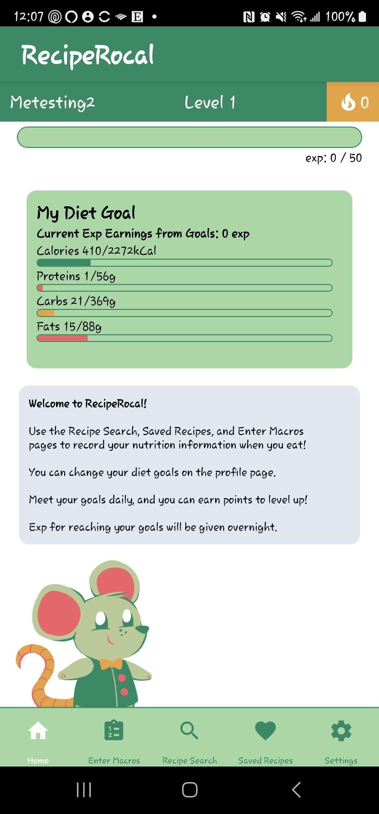
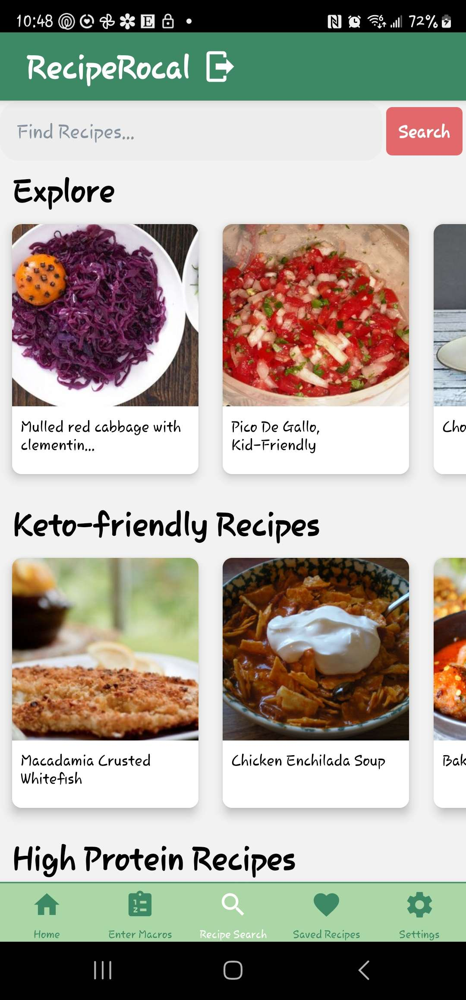

# RecipeRocal – Gamified Nutrition & Recipe Tracking App

> **Academic Project | Texas A&M University (Jan 2024 – May 2024)**

> **Important Notice** \
> This project is **not a downloadable app** as time constraints did not allow for the push to Google Play. However, it is executable through an **Android emulator**.

---

[![LinkedIn][linkedin-shield]][linkedin-url]
[![Texas A&M University][tamu-shield]][tamu-url]

  

  <h2>RecipeRocal</h2>
  
<i>An Android mobile app that makes healthy eating engaging through gamification, goal tracking, and smart recipe discovery</i>

  
Table of Contents

  <ol>
    <li><a href="#project-overview">Project Overview</a></li>
    <li><a href="#problem-statement">Problem Statement</a></li>
    <li><a href="#proposed-solution">Proposed Solution</a></li>
    <li><a href="#built-with">Built With</a></li>
    <li>
      <a href="#project-roadmap">Project Roadmap</a>
      <ul>
        <li><a href="#sprint-1--foundation">Sprint 1 – Foundation</a></li>
        <li><a href="#sprint-2--core-features">Sprint 2 – Core Features</a></li>
        <li><a href="#sprint-3--gamification--notifications">Sprint 3 – Gamification & Notifications</a></li>
        <li><a href="#sprint-4--accessibility--polish">Sprint 4 – Accessibility & Polish</a></li>
      </ul>
    </li>
    <li>
      <a href="#application-screens">Application Screens</a>
      <ul>
        <li><a href="#daily-progress--dietary-tracking">Daily Progress & Dietary Tracking</a></li>
        <li><a href="#recipe-search--discovery">Recipe Search & Discovery</a></li>
      </ul>
    </li>
    <li><a href="#project-demo">Project Demo</a></li>
    <li><a href="#my-role--impact">My Role & Impact</a></li>
    <li><a href="#team--contributions">Team & Contributions</a></li>
    <li><a href="#acknowledgements">Acknowledgements</a></li>
  </ol>

(<a href="#readme-top">back to top</a>)

---

## Project Overview

  

RecipeRocal is an **Android mobile application** designed to promote healthier eating habits through **gamification**, **goal-driven nutrition tracking**, and **recipe discovery**. Users can set daily macronutrient goals, log meals manually, or discover new recipes using the **Edamam API**, making nutrition tracking both informative and enjoyable.

The app emphasizes:

- Daily macronutrient goal setting and progress tracking
- Gamified point and experience systems to encourage consistency
- Cloud-based, real-time data synchronization using Firebase
- Research-driven UI/UX with accessibility and clarity in mind
- Scalable architecture suitable for iterative feature growth

RecipeRocal was developed by a **five-member Agile team** as part of a university software engineering capstone project.

(<a href="#readme-top">back to top</a>)

---

## Problem Statement

Many nutrition tracking apps suffer from one or more of the following issues:

- High friction for daily logging
- Lack of motivation or engagement over time
- Overwhelming or cluttered interfaces
- Poor accessibility and usability on mobile devices

Our objective was to design a mobile-first experience that keeps users **motivated**, **informed**, and **engaged** while maintaining simplicity and accessibility.

(<a href="#readme-top">back to top</a>)

---

## Proposed Solution

RecipeRocal addresses these challenges by combining:

- **Gamification** (points, experience levels, progress meters)
- **Personalized nutrition goals** with visual feedback
- **Recipe discovery** through external APIs
- **Cloud-backed persistence** for seamless cross-session usage
- **Accessibility features** such as language translation

The result is a nutrition app that feels less like a chore and more like a rewarding daily habit.

(<a href="#readme-top">back to top</a>)

---

## Built With

* [![React Native][react-native-shield]][react-native-url]
* [![Metro][metro-shield]][metro-url]
* [![Firebase][firebase-shield]][firebase-url]
* [![Firestore][firestore-shield]][firestore-url]
* [![Edamam API][edamam-shield]][edamam-url]
* [![Android Studio][android-studio-shield]][android-studio-url]
* [![Jira][jira-shield]][jira-url]

(<a href="#readme-top">back to top</a>)

---

## Project Roadmap

### Sprint 1 – Foundation

- Android compatibility and project setup
- Firebase database configuration
- Documentation and workflow setup
- Initial home screen and navigation structure

---

### Sprint 2 – Core Features

- Expanded Firebase integration
- Initial data models for users and meals
- Continued UI development and navigation flow
- Backend groundwork for future gamification

---

### Sprint 3 – Gamification & Notifications

- Meal logging system
- Point and experience tracking
- Firebase notification compatibility
- Backend logic for scoring and rewards

---

### Sprint 4 – Accessibility & Polish

- Language translation support
- Experience leveling system with scheduled updates
- Improved recipe displays and recommendations
- UI/UX refinements based on testing and feedback

(<a href="#readme-top">back to top</a>)

---

## Application Screens

### Daily Progress & Dietary Tracking

  

Track your profile, experience level, and daily macronutrient goals with interactive progress meters. Helpful tips and a friendly mascot guide users throughout the app.

---

### Recipe Search & Discovery

  

Search for recipes directly or browse curated categories such as **Keto-friendly** and **High-protein**, powered by the Edamam API.

(<a href="#readme-top">back to top</a>)

---

## Project Demo

  

(<a href="#readme-top">back to top</a>)

---

## My Role & Impact

I served as the **Frontend Lead** for RecipeRocal, with primary ownership over the **mobile UI/UX**, **user interaction flows**, and **visual feedback systems**. My contributions focused on making the app intuitive, motivating, and accessible.

Key responsibilities included:

- Designing and implementing core mobile screens using React Native
- Building interactive progress meters and gamification visuals
- Translating research findings into user-centered UI decisions
- Collaborating closely with backend and Agile leads to align features
- Iterating on accessibility, clarity, and overall user experience

(<a href="#readme-top">back to top</a>)

---

## Team & Contributions

Special thanks to my fellow team members:

- **[Lydia Harbert][lydia-harbert-linkedin-url]** — Frontend Design & Support \
  Assisted with graphic/UI design and frontend implementation.
- **[Ethan Huynh][ethan-huynh-linkedin-url]** — Backend Lead \
  Led backend architecture and Firebase integration.
- **[Evan Herchek][evan-herchek-linkedin-url]** — CI/CD Lead & Frontend Support \
  Managed CI/CD workflows and contributed to frontend features.
- **[Juliana Leano][juliana-leano-linkedin-url]** — Agile Lead & Backend Support \
  Coordinated Agile processes and supported backend development.

Extra thanks to our project advisors:

- **[Dr. Shawna Thomas][shawna-thomas-linkedin-url]** — Professor
- **[Akash Jothi][akash-jothi-linkedin-url]** — Teaching Assistant

(<a href="#readme-top">back to top</a>)

---

## Acknowledgements

Special thanks to these additional resources:

* [Best-README-Template by othneildrew][readme-template-url]
* [Img Shields][shields-url]

(<a href="#readme-top">back to top</a>)

<!-- VARS -->

<!-- SHIELDS & LINKS -->
[linkedin-shield]: https://custom-icon-badges.demolab.com/badge/LinkedIn-0A66C2?style=for-the-badge&logo=linkedin-white&logoColor=fff
[linkedin-url]: https://www.linkedin.com/in/kardalan/
[tamu-shield]: https://img.shields.io/badge/TEXAS_A%26M_UNIVERSITY-500000?style=for-the-badge&logo=data:image/png;base64,iVBORw0KGgoAAAANSUhEUgAAABwAAAAcCAMAAABF0y+mAAAAkFBMVEVQAAFQAABPAABFAABOAABdGRq/qanCra1hKShNAABoLCv////S0tLMzs7o6up1RUVlJif5+fn07+/e39/k3t5VAABcDw7s5eXk399KAADbzc3h1tZVDg57Tk5IAABwPT1+U1O2oKClh4ddISCSbm2vlZViICDJtraLZGQ9AADPv77YysqaeHdpNTXOu7uFW1uEcO8+AAABT0lEQVR4AYXShcKzIBiGYeBlwZ4lC350Yse/PP+z+8T4Ou6FymUr+zP+TaMJ+ibZm5xMvzab96oWWK4+tcZG9bgFdkPrcbp+h4Buh4Cln2hg/wEP6ng8GSz/LY5HG+DjliFJdW7xMFeSAgADChZF0UZx0aMjipMokUTC43maTjM7YF6k6YasK9PppEVVATjQgOcaCKxrACz8ljYEpiPmGw0k//2Q6G+C3hklhmOKFi8JgIwY45Qiq1G4Abk2IQxqZI4xyTWMRkByxEMDXG8eOd2gjdkhciMaFyJpkZi4H5AIlaHOeYcLbfIipBKlZXIHlOQCIFDjpdQqrgBsmXxcLjenysul7HCSXS6ZtZPH41Ix4ZxTXFiyk7u/8ZtKkeXcD8v+BWr/1aZ/ZNg9rV/2sTG1QdsO6/XTjmMf0fO3GB/6TPQVuXRDkrOvKoZ6+7MXqawjzwlTuwAAAAAASUVORK5CYII=&logoColor=%23500000&color=%23500000
[tamu-url]: https://www.tamu.edu/index.html
[react-native-shield]: https://img.shields.io/badge/React_Native-%2320232a.svg?logo=react&logoColor=%2361DAFB&style=for-the-badge
[react-native-url]: https://reactnative.dev/
[metro-shield]: https://img.shields.io/badge/Metro-EF4242?logo=metro&logoColor=fff&style=for-the-badge
[metro-url]: https://metrobundler.dev/docs/getting-started/
[firebase-shield]: https://img.shields.io/badge/Firebase-DD2C00?logo=firebase&logoColor=fff&style=for-the-badge
[firebase-url]: https://firebase.google.com/
[firestore-shield]: https://img.shields.io/badge/_-Firestore-010f31?style=for-the-badge&logo=data%3Aimage%2Fpng%3Bbase64%2CiVBORw0KGgoAAAANSUhEUgAAABwAAAAcCAYAAAByDd%2BUAAABYElEQVR4Ab3WAUQDURgH8A8ACCAABHLBIACCUBAkgIAgIkEAhIEkgEBAIEAER5ZgAImupYCSAoHD3u5ve3O3P7f%2Fvb0Nf87s%2FO5777vvnm0ebS80QTe9J9bqJZZFAwXMIcX17VzBz8SWPFZC23MDe6v2AoRR24kOfm3ZHmMVtKWB%2Bt79EFRNLoJ6owjJYoFtARM6VwTx5CLoczgr6Jrm79SWJRB%2FdI92X%2BR1lJvvXXNvK0gjtCuBAFzH3DhpkcthPKyiaLapIBDKufU9%2BrsPNLyBJqvbIOzJg0GV5vVgxw6AUK4JlavE%2FK0DT7hCgEKVMsgVMpgy%2BH8cDPIeKlXmZxqodiknDQK7CvigVKksKT5p08E7W2OwhOpNk0uThqcNB1V6TJ0yDPLSZnVL%2B7HOFfI5Rwd5P3kf%2FZhD%2BNPUEOR3M61i5W7FfuKAhWWMeohyF3ZV5Bkogmv8hkaLf0yMlAG6buWX70J8MQAAAABJRU5ErkJggg%3D%3D&logoColor=%23010f31&color=%23010f31
[firestore-url]: https://firebase.google.com/docs/firestore
[edamam-shield]: https://img.shields.io/badge/_-Edamam-444A5A?style=for-the-badge&logo=data%3Aimage%2Fpng%3Bbase64%2CiVBORw0KGgoAAAANSUhEUgAAACAAAAAgCAYAAABzenr0AAAChklEQVR4AcWXA6xcQRSGb20jqo2gthujdhuW69q2GdQ2o9rG%2Btm27fdOz9lMfTHbvZud5Fv%2BB3fmjASeprUI1ZHGyBBkI3IPMSOhDDP7bTNpmLa6oEKj4O2QtUigxiwAvsvCNIHMpp0ngetqzcICfI9F4D8h2wXky93grZE7SDkCHlKuNbt8teYKrrEInVBsR0Bl7ORb%2BcnNglP14Azmu7XkmLNuBy9DMeqKJbBEasyX2RrCGkdrbky2%2BvI1gbHEpppotZ%2BJmAbllaXgTiuuyIPDISOVZke73xeZ9VLi81FzoKgiB8oqi7nJL0%2BDY6HjlYZiPcWmBJoigVJCvaUmbA%2FoCbsD%2B3Kz1b8r6Cw1lBIIpNiUwDAZETqqDhucbWGzX8efrLA3Vasgh1ECG%2BVEp8ImQkTO6z%2BwpF2FleoksZESuCUnoqo%2BHzETLkbOY8yFoyFjqIvVWBfuUQJWBHyEVcAsIuVEe4P6Q1T%2BJ0gs8ucmJPclbMFC5OiBSAG3z3A50a1YPVRVVYI7raKqnNYPnq07nIbALCdaZmsE5yJnwdWYBdycipgEJms9niEwKxYhYbDUQod1XRgRnaUa%2Fa5aEa6XEx0OHgn29FvgzLjrwoG8SNxH%2B4MaSaynGhgiJ9oR0BueJ%2B6FV0mHfnIrRoM9UcfjBCi2wlLsRdhSrLgZ0TL8PPkAvE87xc2jpB2w2tGKazNS3I4fxK8Gd1tVVRXtolzb8c%2BmNbsOJJViPfAm9QR8Sj%2FPzbPk%2FbDK0ZL%2FQOL7IxlrGrN3D6Ua9E0xfHYsRzrxX0zMPriYiNTEAq3Za1cz%2Fsuphl1O3VlkNNyXU%2F7reVNkGBbRRnR%2B6%2B%2FrOf1G%2F5GGtLzX8%2B%2BPCuDVGtaGlAAAAABJRU5ErkJggg%3D%3D&logoColor=%23444A5A&color=%23444A5A
[edamam-url]: https://www.edamam.com/
[android-studio-shield]: https://img.shields.io/badge/_-Android_Studio-202124?style=for-the-badge&logo=data%3Aimage%2Fpng%3Bbase64%2CiVBORw0KGgoAAAANSUhEUgAAABwAAAAcCAMAAABF0y%2BmAAAAWlBMVEVHcExatmAyikU9lEpJpFdTr1tVsl1PrlRIolRQrFowiUFYtFxWs1tGnVNPr1NZtl9Vs1pRsVZduWRivWhMp1ZUr14GBAZHoVNBlEsvOzBBmksvZjE9jkY%2BfUJA%2BEjFAAAADnRSTlMAv9i%2BZp1xMBW0NFHkj7ECPhsAAADQSURBVCiRzdDdEoIgEAVgTNToh11wF9Tq%2FV%2BzpRiCmu49V8inu2dUapc5fV9Mn2O%2FXVu7xkM5HzY61naMywdPC3U1mnivFvWEZ1mkx1HLtglj38xxF%2BPwHXNxsdkyIOR47wGHxuSu6Dx7qLSTC8hDMensS0GTXkaXg%2FhS87ZRHviONsc5WEAmja%2BmydZwc0VvYYXZc2o8CD5CjWsID8E0mKXoElayBbcQyHsmpTQDoLPlu6TWSmcmrQwx1pIdgMkoHemHBJEpamk7%2FUnzf%2FeRJymOFA4d4haTAAAAAElFTkSuQmCC&logoColor=%23202124&color=%23202124
[android-studio-url]: https://developer.android.com/studio
[jira-shield]: https://img.shields.io/badge/Jira-0052CC?logo=jira&logoColor=fff&style=for-the-badge
[jira-url]: https://www.atlassian.com/software/jira

<!-- IMAGE SOURCES -->
[daily-progress-screenshot]: git_images/HomePage.jpg
[recipe-search-screenshot]: git_images/RecipeSearchPage.jpg

<!-- VIDEO LINKS -->
[project-demo-thumbnail]: https://img.youtube.com/vi/l7DCKpieW6o/0.jpg
[project-demo-link]: https://www.youtube.com/watch?v=l7DCKpieW6o
[project-advertisement-thumbnail]: https://img.youtube.com/vi/vwlEttW6ANs/0.jpg
[project-advertisement-link]: https://www.youtube.com/watch?v=vwlEttW6ANs

<!-- MISC LINKS -->
[lydia-harbert-linkedin-url]: https://www.linkedin.com/in/lydia-harbert/
[ethan-huynh-linkedin-url]: https://www.linkedin.com/in/ethan-q-huynh/
[evan-herchek-linkedin-url]: https://www.linkedin.com/in/evan-herchek/
[juliana-leano-linkedin-url]: https://www.linkedin.com/in/juliana-l-267b05199/
[shawna-thomas-linkedin-url]: https://www.linkedin.com/in/shawna-thomas-a52b62a/
[akash-jothi-linkedin-url]: https://www.linkedin.com/in/akash-jothi-2668b61b5/
[readme-template-url]: https://github.com/othneildrew/Best-README-Template
[shields-url]: https://shields.io
